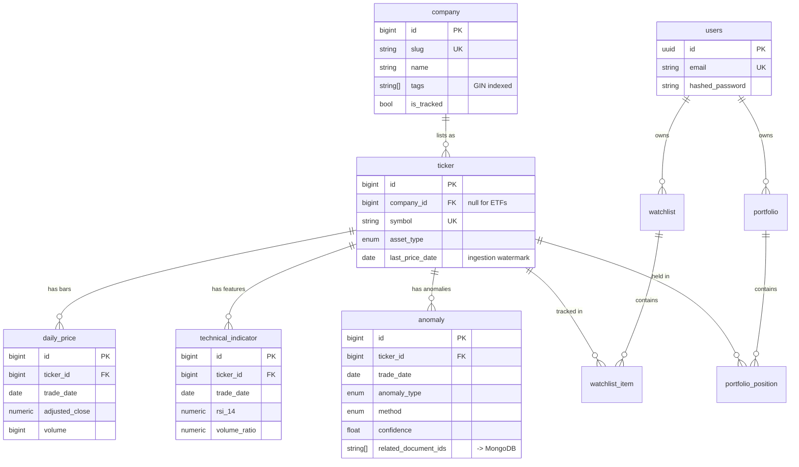

# Data model

Twelve PostgreSQL tables and seven MongoDB collections. This document records
the reasoning; column-level detail lives in the model docstrings.

---

## PostgreSQL

Plus two tables with no foreign keys: `market_calendar` (per-exchange trading
sessions) and `daily_market_summary` (the generated briefing).

### Company vs ticker

A **company** is the economic entity an analyst reasons about; a **ticker** is a
tradable listing of it. SK Hynix and Samsung list in Seoul, TSMC trades as a US
ADR, and an ETF is a listing with no company at all — `ticker.company_id` is
nullable for exactly that reason. Collapsing the two would make each of those a
special case in every query.

### Primary keys: two strategies

| Kind | Type | Where | Why |
| --- | --- | --- | --- |
| Internal, high volume | `BIGINT IDENTITY` | prices, indicators, anomalies, companies, tickers | Compact and sequential, so indexes stay small and range scans stay fast. |
| Client-visible | `UUID` | users, watchlists, portfolios | A sequential id in a URL leaks table size and lets anyone enumerate accounts by counting upwards. |

### Idempotency

Every table an ingestion job writes to has a natural unique key, and every write
is an upsert targeting it:

| Table | Key | Effect of a re-run |
| --- | --- | --- |
| `daily_price` | `(ticker_id, trade_date)` | Bars refresh; vendor corrections apply. |
| `technical_indicator` | `(ticker_id, trade_date)` | Features recompute, including back to NULL. |
| `anomaly` | `(ticker_id, trade_date, anomaly_type, method)` | Each detector refreshes its own verdict. |
| `market_calendar` | `(exchange, session_date)` | Calendar corrections apply. |
| `daily_market_summary` | `(summary_date)` | Briefing regenerates. |

`method` is part of the anomaly key because a Z-score and an Isolation Forest
score are not comparable. Keeping both rows makes the detectors' disagreement
visible instead of averaging it away.

### Types and constraints

- **`NUMERIC`, never `FLOAT`**, for prices, returns and quantities. Binary
  floating point cannot represent `0.1` exactly, and errors compound across a
  return series. `FLOAT` appears only on `anomaly.score` and
  `anomaly.confidence`, where the last bit is meaningless.
- **Native `ENUM` types**, generated with `values_callable` so PostgreSQL stores
  `'z_score'` — the `StrEnum` *value* — rather than the member name `'Z_SCORE'`.
  Without that, every CHECK constraint and hand-written query would silently
  fail to match.
- **CHECK constraints** encode invariants the database can enforce alone:
  `high >= low`, `volume >= 0`, `confidence BETWEEN 0 AND 1`, `quantity >= 0`.
- **`ON DELETE CASCADE` in the database**, not only in the ORM, so deleting a
  user removes their data even when the delete comes from psql or a migration.

### Naming conventions

`Base.metadata` carries a naming convention, which is what makes Alembic
migrations reversible — an unnamed constraint gets a database-assigned name that
a downgrade cannot target.

It also prevents a subtler failure. PostgreSQL keeps constraints and indexes in
**one namespace per schema**, so two tables with an identically named unique
constraint collide at `CREATE TABLE` time. The convention prefixes every name
with its table; models therefore leave unique and foreign-key constraints
unnamed and let it do its job. `tests/test_models.py` asserts no name collides.

### Indexes

Deliberately few. Every index is write amplification on the ingestion path, so
each one names the query it serves:

| Index | Serves |
| --- | --- |
| `uq_company_slug`, `uq_ticker_symbol` | Lookup by public identifier. |
| `ix_company_tags_gin` | "Which companies are exposed to HBM?" via array containment. |
| `uq_daily_price_ticker_id` *(from the unique constraint)* | Per-ticker history and the upsert conflict target. |
| `ix_daily_price_trade_date` | Cross-sectional reads: every ticker on one date, for the heatmap. |
| `ix_anomaly_date_severity` | The "unusual movements this month" feed. |
| `ix_ticker_active_symbol` | The ingestion scheduler's work queue. |

Notably **absent**: descending `(ticker_id, trade_date DESC)` indexes. They look
useful for "the last N sessions", but PostgreSQL serves that from an ascending
index with a backward scan at the same cost — DESC only earns its keep for
*mixed* orderings. They would have duplicated the unique constraints' indexes,
and they made `alembic check` report drift forever, since reflection cannot
round-trip index operator classes.

---

## MongoDB

| Collection | Holds |
| --- | --- |
| `news_articles` | Normalised articles from NewsAPI, RSS and IR pages. |
| `company_reports` | SEC filings and investor-relations documents. |
| `earnings_call_transcripts` | Call transcripts. |
| `rag_documents` | Embedded chunks; the vector-search target. |
| `llm_summaries` | Generated summaries with their provenance. |
| `chat_history` | Conversation turns and what each answer retrieved. |
| `user_preferences` | Per-account settings. |

Schemas are defined as Pydantic models in `app/schemas/documents.py`. MongoDB
does not enforce them — that is the point of writing them down. The flexibility
that makes it right for news becomes a liability the moment one producer writes
`published` where a consumer reads `published_at`.

### Deduplication

`news_articles.url_hash` is a SHA-256 of the canonical URL with a unique index.
The same story arrives from an RSS feed and from NewsAPI minutes apart; without
this, the correlation engine would count one event as two pieces of evidence.

### Indexes

Declared as data in `app/db/mongo_indexes.py` and applied at startup — MongoDB
has no migration tool. Creation is idempotent and non-fatal: a missing index
degrades latency, not correctness, so a failure is logged and the API still
serves.

The **Atlas Vector Search** index is deliberately not created there. It is a
search index managed by a separate Atlas API that local MongoDB does not
implement; `vector_index_definition()` emits its JSON for the Atlas UI, CLI or
Terraform. Two details in it matter:

- `cosine` similarity, correct for OpenAI embeddings.
- `filter` fields on `tickers`, `tags` and `published_at`, so Atlas applies
  metadata predicates *during* the vector scan. Filtering afterwards returns the
  global top-k and then discards non-matching hits, often leaving far fewer than
  k results.

### Crossing the two stores

`anomaly.related_document_ids` holds MongoDB `_id` values. PostgreSQL cannot
enforce that reference, and a distributed transaction to make it enforceable
would cost far more than the reconciliation job that repairs it. Consistency
across the stores is eventual, by design.

---

## Repository layer

`BaseRepository[ModelT, IdT]` is generic over both the model and its key type —
the platform genuinely uses two key types, and one base would have to lie about
one of them. It provides CRUD; subclasses add queries in the vocabulary of their
domain (`list_stale`, `list_unexplained`, `get_cross_section`).

Nothing in a repository commits. Transaction boundaries belong to the caller's
unit of work, which is what lets a service compose several repository calls into
one atomic operation.

Relationships are configured `lazy="raise_on_sql"`. Touching an unloaded
relationship raises immediately instead of emitting a query per row, so an N+1
is a loud test failure rather than a slow endpoint in production. Repositories
that need related data load it explicitly with `selectinload`.

---

## Seed data

`app/db/seed_data.py` holds the tracked universe as typed Python: 11 companies,
14 listings including SMH, SOXX and VOO. Reference data belongs in version
control, where it is reviewable in a diff and importable by tests.

`app/db/seed.py` matches companies on `slug` and tickers on `symbol`, so
re-running updates rather than duplicating — safe to run on every deployment.
Ingestion watermarks are never reset by a re-seed.

`SMH` is the benchmark `relative_strength_smh` is computed against; `VOO` is the
broad-market control that separates an AI-specific move from the whole market
rising.
